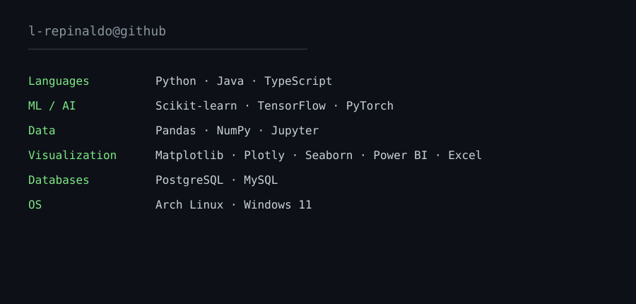
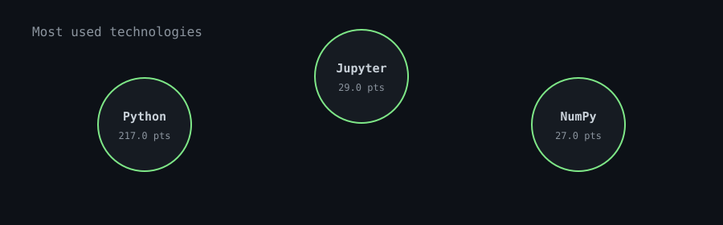

    #!/usr/bin/python
    # -*- coding: utf-8 -*-
    
    
    class LRepinaldo:
    
        def __init__(self):
            self.name = "Lucas Repinaldo"
            self.role = "Data Science & Machine Learning"
            self.language_spoken = ["pt_BR", "en_US"]
    
        def say_hi(self):
            print("Hello")
    
    
    me = SoftwareEngineer()
    me.say_hi()  

## About
I like to solve puzzles, understand how the things works and build solutions while taking these aspects into account .  
My work involves data analysis, data cleaning, experimentation, and applying ML/AI to real-world problems.  

## 💻 Tech Stack

<table>
<tr>
<td width="30%">

</td>

<td width="70%">

  

</td>
</tr>
</table>

### Top stack

  

